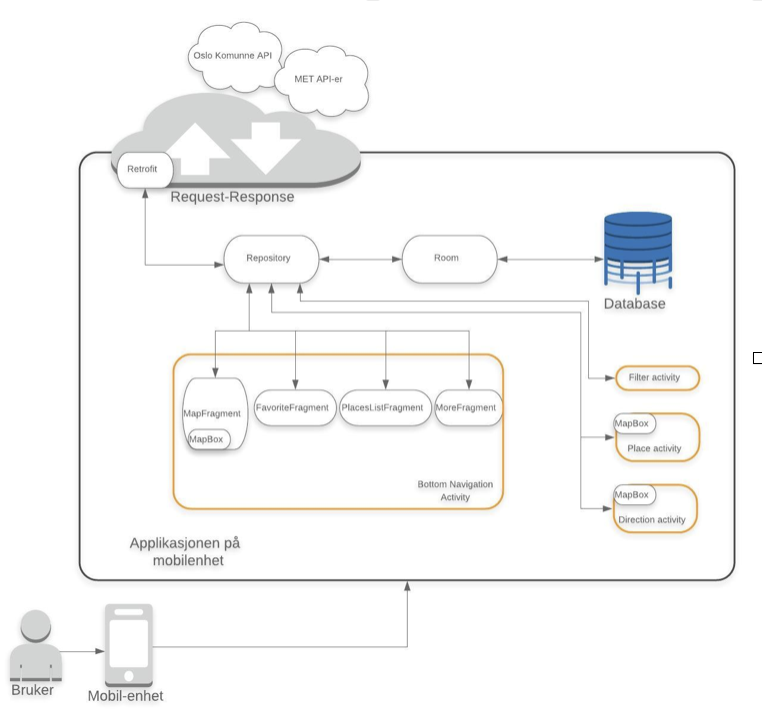
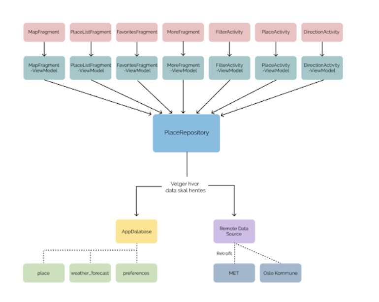

# Splæsj  

This folder contains the code for android application developed as a part of school project in course Software Engineering, IN2000. <
This application is designed to give an overview of beaches and other swimming spots in Oslo. 
See also DempSplæsj.mp4 to get an illustration of the application functionality.<\br>

## Functionality:
- [x] Map visualisation with all possible swimming locations markers.
- [x] List visualisation with all possible swimming locations markers.
- [x] Filtering swimming locations due to user´s preferences such as water temperature and air temperature.
- [x] Visualisation of data about specific swimming location such as water temp, UV, weather forecast etc.
- [x] Storing swimming spots as favourites
- [x] "Fine route" functionality.  

## APIs:
* Map > [MapBox](https://www.mapbox.com/)
* Weather conditions > [Meteorologisk insitutt - location forecast](https://api.met.no/weatherapi/locationforecast/2.0/documentation)
* Swimming places and water temperature > [Oslo komunne](http://oslokommune.msolution.no/friluft/badetemperaturer.jsp)

## Architecture:
The application is developed according to MVVM-architecture and the architecture is sketched below: 
**General**

**MVVM**

## Tech stack:
* Android Studio
* Kotlin
* SQLite
* Retrofit
* Fuel
* Espresso 
* Junit
* MVVM

__Contributors__: 

Ellina Ivleva, [ellinaiv](https://github.com/ellinaiv) 
Marlen Jarholt, [marlenjarholt](https://github.com/marlenjarholt) 
Johanna Hårseth, [johannahaarseth](https://github.com/johannahaarseth) 
Linn Melanie Østbøll, [mullmon](https://github.com/mullmon) 
Maria Løvland Johansson, marialjo 
Silje Helene Lund, siljehlu 

